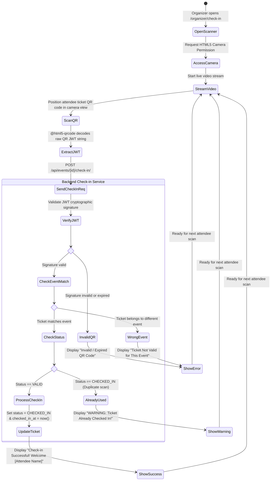

# A Minor Project Final Report on

## Karyakram: Event Management and Ticket Booking Platform

**Submitted in Partial Fulfillment of the Requirements for the Degree of Bachelor of Engineering in Software Engineering under Pokhara University**

---

### Submitted by:
- **Siddhant Chhetri** (231644)
- **Aman Joshi** (231604)
- **Madhusudhan Gharti** (231620)

### Under the supervision of:
- **Er. Manil Vaidhya**

**Date:** 7 August 2026

**Department of Software Engineering**  
**NEPAL COLLEGE OF INFORMATION TECHNOLOGY**  
Balkumari, Lalitpur, Nepal  

---

## COPYRIGHT

The author has agreed that the library, Nepal College of Information Technology, may make this report freely available for inspection. Moreover, the author has agreed that permission for extensive copying of this project report for scholarly purposes may be granted by the supervisor who supervised the project work recorded herein or, in their absence, by the Head of the Department. It is understood that due recognition will be given to the author and to the Department of Software Engineering, Nepal College of Information Technology, in any use of the material of this report.

Copying or publication or any other use of this report for financial gain without the approval of the Department of Software Engineering, Nepal College of Information Technology, and the author's written permission is prohibited.

Request for permission to copy or to make any other use of the material in this report, in whole or in part, should be addressed to:

Head of Department  
Department of Software Engineering  
Nepal College of Information Technology  
Balkumari, Lalitpur, Nepal  

---

## ACKNOWLEDGEMENT

We would like to express our sincere gratitude to all those who contributed to the successful completion of this project.
First and foremost, we are deeply thankful to our project supervisor, Er. Manil Vaidhya, for his continuous guidance, constructive feedback, and encouragement throughout the development of Karyakram. His technical expertise and mentorship were invaluable in shaping the direction and quality of this work.

We extend our heartfelt thanks to the Head of Department and all the faculty members of the Department of Software Engineering, Nepal College of Information Technology, for providing a supportive academic environment and the resources necessary to carry out this project.

We are also grateful to Nepal College of Information Technology for the opportunity to undertake this minor project as part of our Bachelor's program in Software Engineering under Pokhara University.

Finally, we would like to thank our families and friends for their unwavering support, patience, and encouragement throughout this journey.

*Siddhant Chhetri, Aman Joshi, Madhusudhan Gharti*  
*7 August 2026*  

---

## ABSTRACT

Karyakram is a web-based event management and ticket booking platform developed to address the growing need for a localized, affordable digital solution for event organizers in Nepal. The platform targets educational institutions, corporate organizations, and community groups that previously relied on manual, spreadsheet-driven processes for event registration, ticket sales, and attendee management. The system is structured around three user roles: attendees who browse and purchase tickets, organizers who create and manage events, and administrators who oversee approvals and platform operations.

The platform delivers a complete, integrated solution encompassing user registration with OTP-based email verification, JWT authentication, role-based access control, event and ticket-tier management, and a booking workflow with real-time inventory updates. Organizers can create and publish events, while attendees receive QR-code-based digital tickets upon successful booking. The QR tickets can be scanned and validated at event check-in points, providing a seamless end-to-end attendee experience. Online payment support is provided through integration with eSewa, a leading local payment gateway in Nepal. An analytics dashboard and automated email notification system further enhance platform usability for both organizers and administrators.

Karyakram was developed using Django REST Framework, React.js, and PostgreSQL within an Agile methodology, ensuring iterative improvement and timely delivery. The resulting platform is a scalable, production-ready solution for Nepal's event ecosystem, positioned for wider adoption and future commercialization across the Nepalese market.

**Keywords:** Event Management, Ticket Booking, QR Code, Role-Based Access Control, Django REST Framework, React.js, PostgreSQL, eSewa, Agile Methodology, JWT Authentication, Web Application

---

## TABLE OF CONTENTS

- COPYRIGHT (i)
- ACKNOWLEDGEMENT (ii)
- ABSTRACT (iii)
- LIST OF FIGURES
- LIST OF SYMBOLS AND ABBREVIATIONS
- **CHAPTER 1: INTRODUCTION**
  - 1.1 Problem Statement
  - 1.2 Objectives
  - 1.3 Scope and Limitations
- **CHAPTER 2: LITERATURE REVIEW**
  - 2.1 Existing Event Management Systems
  - 2.2 Existing Ticketing Platforms
  - 2.3 Research Gap
  - 2.4 Technology Review
- **CHAPTER 3: METHODOLOGY**
  - 3.1 Agile Methodology
  - 3.2 Sprint History (Development Logs)
  - 3.3 System Architecture
  - 3.4 Use Case Diagram
  - 3.5 Activity Diagrams
  - 3.6 Sequence Diagram
- **CHAPTER 4: RESULTS, TESTING AND DISCUSSION**
  - 4.1 System Implementation & Capabilities
  - 4.2 Software Testing & Test Cases Execution
  - 4.3 API Testing & Postman Validation
- **CHAPTER 5: CONCLUSION, LIMITATIONS AND FUTURE WORK**
  - 5.1 System Summary
  - 5.2 System Limitations
  - 5.3 Future Work
- REFERENCES

---

## LIST OF FIGURES

- Figure 1: System architecture
- Figure 2: Use case diagram
- Figure 3: Activity Diagram of Event Creation and Approval
- Figure 4: Activity Diagram of Event Booking and Ticket Purchase
- Figure 5: Activity Diagram of QR Ticket Validation
- Figure 6: Sequence Diagram of Booking

---

## LIST OF SYMBOLS AND ABBREVIATIONS

- **API:** Application Programming Interface
- **CORS:** Cross-Origin Resource Sharing
- **CRUD:** Create, Read, Update, Delete
- **DB:** Database
- **DRF:** Django REST Framework
- **HTTP:** Hypertext Transfer Protocol
- **JWT:** JSON Web Token
- **ORM:** Object Relational Mapper
- **OTP:** One-Time Password
- **QR:** Quick Response
- **RBAC:** Role-Based Access Control
- **REST:** Representational State Transfer
- **SaaS:** Software as a Service
- **UI/UX:** User Interface / User Experience
- **URL:** Uniform Resource Locator
- **UUID:** Universally Unique Identifier
- **VCS:** Version Control System

---

# CHAPTER 1: INTRODUCTION

Event management is widely used in educational institutions, businesses, and community organizations. However, in Nepal, many events are still managed using manual or spreadsheet-based methods, which are inefficient and time-consuming. Karyakram is a web-based platform designed to provide a simple, centralized solution for event management, registration, and ticket booking.

### 1.1 Problem Statement
Event management in Nepal faces issues such as manual processes, poor attendee tracking, difficulty in ticket handling, lack of centralized information, and limited analytics. These problems reduce efficiency and increase workload. A digital system is needed to automate and simplify these operations.

### 1.2 Objectives

#### General Objective
To develop a web-based platform for managing events and ticket bookings efficiently.

#### Specific Objectives
- Create and manage events with multi-tier pricing structures.
- Enable online ticket booking with instantaneous inventory locking and localized Nepalese payment gateway support (eSewa).
- Provide secure role-based access control (Attendee, Organizer, Administrator).
- Generate, deliver, and verify tamper-proof QR-code digital ticket passes.

### 1.3 Scope and Limitations

#### Scope
The system supports event management, user registration with OTP validation, ticket booking with hold timers, QR-based tickets, eSewa payment reconciliation, and administrative/organizer analytics.

#### Limitations
The current version does not include a dedicated native mobile app (operates via responsive web app), offline check-in caching without network connectivity, or multi-language interface switching.

---

# CHAPTER 2: LITERATURE REVIEW

### 2.1 Existing Event Management Systems
Event management systems are used to plan, organize, and manage events efficiently. They typically provide features such as event scheduling, registration handling, ticket sales, and basic analytics to support organizers in managing attendees and event operations.

### 2.2 Existing Ticketing Platforms

#### Eventbrite
- **Strengths:** User-friendly interface, supports online payments, easy event discovery.
- **Limitations:** High service fees, limited localization for Nepalese currency and gateways.

#### Ticketmaster
- **Strengths:** Strong infrastructure, highly scalable for stadium-scale events.
- **Limitations:** Complex onboarding, high overhead, unsuitable for local college/corporate events in Nepal.

#### Local Ticketing Systems
- **Strengths:** Better understanding of local context.
- **Limitations:** Limited functionality, poor QR check-in security, lack of real-time inventory concurrency handling.

### 2.3 Research Gap
Existing platforms either focus on global markets, charge prohibitive transaction fees, or lack digital features tailored to Nepal (such as eSewa integration and fast QR check-in). There is a clear need for a localized, affordable, and scalable event management solution.

### 2.4 Technology Review
The Karyakram system is developed using modern web technologies to ensure scalability, performance, and security:
- **Django REST Framework:** RESTful APIs, ORM database mapping, business logic layer.
- **PostgreSQL:** ACID-compliant relational data store.
- **Celery & Redis:** Asynchronous task processing for email dispatches and background seat hold releases.
- **React.js & Vite:** Reactive frontend UI build with modern component libraries.
- **JWT & RBAC:** Secure authentication with granular permissions for attendees, organizers, and admins.

---

# CHAPTER 3: METHODOLOGY

### 3.1 Agile Methodology
Karyakram has been developed using the Agile methodology organized into short iterative sprints. This enabled continuous feedback, early integration of payment systems, and rapid adaptation to UI/UX requirements.

### 3.2 Sprint History (Development Logs)
- **Sprint 1 (June 13 – June 25, 2026):** Django project scaffolding, custom user models, authentication endpoints (JWT login, register, token refresh), initial DB schema.
- **Sprint 2 (June 26 – July 3, 2026):** React + Vite initialization, registration UI, login UI, OTP email validation pipeline.
- **Sprint 3 (July 4 – July 10, 2026):** Event management module, event CRUD, multi-tier ticket pricing models, category filtering.
- **Sprint 4 (July 11 – July 16, 2026):** Organizer approval workflows, admin oversight panels, Swagger/OpenAPI documentation integration.
- **Sprint 5 (July 17 – July 31, 2026):** Booking module implementation, 10-minute hold window logic, atomic inventory management.
- **Sprint 6 (August 1 – August 8, 2026):** eSewa epay v2 integration, HMAC-SHA256 signature verification, compact Version 2 QR code engine, Base64 inline email ticket delivery, organizer camera QR scanner, and automated unit testing suite (31/31 unit tests passing).

### 3.3 System Architecture
*(Refer to System Architecture Diagram in Documentation - React Frontend communicating via REST API to Django Backend, PostgreSQL Database, Celery Worker, Redis Cache, eSewa Gateway, and SMTP Server)*

### 3.4 System Activity Diagrams

#### 3.4.1 Activity Diagram 1: Ticket Booking & eSewa Payment Workflow

```mermaid
stateDiagram-v2
    [*] --> BrowseEvents : Attendee views public event directory
    BrowseEvents --> SelectTier : Select event & ticket tiers (qty)
    SelectTier --> SubmitBooking : Click "Book Now"
    
    state "Backend Booking Engine" as BackendEngine {
        SubmitBooking --> CheckAuth : Verify JWT Token
        CheckAuth --> AcquireLock : Acquire select_for_update() row lock
        AcquireLock --> CheckStock : Verify remaining_quantity >= requested
        
        state stock_check <<choice>>
        CheckStock --> stock_check
        stock_check --> RejectBooking : No (Insufficient Stock)
        stock_check --> ReserveSeats : Yes (Stock Available)
        
        ReserveSeats --> CreatePendingBooking : Create Booking (Status: PENDING)
        CreatePendingBooking --> StartHoldTimer : Stamp hold_expires_at (+10 mins)
    }
    
    RejectBooking --> [*] : Display Out of Stock error
    StartHoldTimer --> InitiatePayment : Redirect to Payment Gateway Selection
    
    InitiatePayment --> eSewaRedirect : Select eSewa & generate HMAC signature
    
    state "eSewa Payment Gateway" as eSewa {
        eSewaRedirect --> PerformPayment : Login to eSewa & Confirm Payment
        
        state payment_result <<choice>>
        PerformPayment --> payment_result
        payment_result --> PaymentFailed : User Cancels / Insufficient Balance
        payment_result --> PaymentSuccess : Transaction Successful
    }
    
    PaymentFailed --> RedirectFailure : Redirect to /my-bookings?status=failure
    RedirectFailure --> CancelBooking : Release reserved seats back to tier inventory
    CancelBooking --> [*] : Show Payment Failed Banner
    
    PaymentSuccess --> CallbackVerification : Redirect to /payment/callback with encoded response
    CallbackVerification --> VerifySignature : Backend decodes & verifies HMAC-SHA256 signature
    
    state signature_check <<choice>>
    VerifySignature --> signature_check
    signature_check --> RejectPayment : Invalid Signature / Amount Mismatch
    signature_check --> ConfirmBooking : Valid Signature & Status Complete
    
    RejectPayment --> RedirectFailure
    
    ConfirmBooking --> GenerateTickets : Create Ticket records & sign JWT payloads
    GenerateTickets --> RenderQR : Render Version 2 (25x25) QR code PNGs
    RenderQR --> SendEmail : Dispatch confirmation email with inline QR passes
    SendEmail --> RedirectSuccess : Redirect to /my-bookings?status=success
    RedirectSuccess --> [*] : Show Booking Confirmed Banner & Issued Tickets
```

#### 3.4.2 Activity Diagram 2: Organizer QR Ticket Scanner & Check-in Workflow

---

# CHAPTER 4: RESULTS, TESTING AND DISCUSSION

### 4.1 System Implementation & Capabilities
The completed Karyakram platform successfully delivers an integrated event management ecosystem:
1. **User Authentication & Role Management:** Secure OTP email verification upon sign-up, JWT access/refresh handling, and admin verification for organizer privileges.
2. **Event & Pricing Management:** Organizers create rich event listings with multiple ticket tiers (e.g., General Admission, VIP) and image attachments.
3. **Atomic Booking & Seat Hold Engine:** Users reserve seats with an automatic 10-minute hold window. Inventory overselling is prevented using database pessimistic locking (`select_for_update`).
4. **eSewa Payment Integration:** Seamless redirection to eSewa epay v2 gateway with server-to-server signature validation and payment reconciliation.
5. **Digital Ticket & QR Scanner Check-in:** Upon confirmation, digital tickets featuring ultra-compact Version 2 (25x25 grid) QR codes are rendered on screen and delivered via inline Base64 HTML emails. Organizers check in attendees using an in-browser camera scanner that executes atomic check-ins.
6. **Analytics & Reporting:** Dashboards provide real-time metrics on revenue, tickets sold, remaining stock, and check-in percentages.

---

### 4.2 Software Testing & Test Cases Execution

The application was subjected to comprehensive automated and manual testing covering unit logic, integration workflows, security bounds, and edge cases. All 31 backend unit tests execute cleanly.

#### Test Cases Execution Summary Table

| Test Case ID | Feature / Module | Test Description | Expected Result | Status |
| :--- | :--- | :--- | :--- | :--- |
| **TC-AUTH-01** | User Auth | Register new user with valid details | OTP email sent; account created in pending verification state. | **PASS** |
| **TC-AUTH-02** | User Auth | Verify email with correct 6-digit OTP | Account state transitions to `is_email_verified=True`. | **PASS** |
| **TC-AUTH-03** | User Auth | Login with incorrect password | Returns HTTP 401 Unauthorized with descriptive error message. | **PASS** |
| **TC-EVENT-01** | Event Management | Organizer creates event with ticket tiers | Event created in `PENDING` approval state. | **PASS** |
| **TC-EVENT-02** | Admin Workflow | Admin approves pending event | Event status becomes `PUBLISHED` and visible in public directory. | **PASS** |
| **TC-BOOK-01** | Booking Engine | Reserve tickets when quantity is available | Booking created in `PENDING` state; 10-minute hold stamped; inventory reduced. | **PASS** |
| **TC-BOOK-02** | Concurrency | Concurrent requests for last remaining ticket | Pessimistic locking allows 1 request to succeed and rejects second with 400 Out of Stock. | **PASS** |
| **TC-BOOK-03** | Expiration | Hold expires past 10 minutes without payment | Celery task releases hold, restores inventory, and sets status to `EXPIRED`. | **PASS** |
| **TC-PAY-01** | eSewa Payment | Initiate payment for pending booking | Valid eSewa form payload generated with HMAC-SHA256 signature. | **PASS** |
| **TC-PAY-02** | eSewa Verification | Verify valid payment response payload | Booking status becomes `CONFIRMED`; payment status `COMPLETED`; tickets issued. | **PASS** |
| **TC-TICK-01** | Ticket Engine | Generate digital pass & QR payload | Compact JWT claims (`t`, `e`, `exp`) signed; Version 2 QR image generated. | **PASS** |
| **TC-TICK-02** | QR Check-in | Organizer scans valid QR pass at event | Ticket status becomes `CHECKED_IN`; checked_in_at timestamp recorded. | **PASS** |
| **TC-TICK-03** | Anti-Passback | Organizer scans already checked-in ticket | Returns HTTP 400 error: "Ticket has already been checked in." | **PASS** |
| **TC-EMAIL-01** | Email Engine | Ticket delivery after payment verification | Inline Base64 HTML email delivered containing visual QR code image. | **PASS** |

---

### 4.3 API Testing & Postman Validation

All API endpoints were validated using Postman and Swagger UI (`/api/docs/`).

#### Postman Testing Workflow & Screenshot Steps
1. **Authentication Request (`POST /api/users/login/`):** Send user credentials in body JSON. Copy the returned `access` JWT token.
2. **Set Authorization Header:** In Postman environment settings, configure `Authorization: Bearer <access_token>` for the collection.
3. **Event Listing (`GET /api/events/`):** Verify response returns HTTP 200 OK with paginated published events list.
4. **Ticket Booking (`POST /api/bookings/`):** Pass event ID and tier selections. Verify response returns HTTP 201 Created with `status: "PENDING"` and `hold_expires_at`.
5. **eSewa Verification (`POST /api/bookings/{id}/payment/verify/`):** Send encoded payment payload (`pidx`). Verify response returns HTTP 200 OK with `status: "CONFIRMED"`.

---

# CHAPTER 5: CONCLUSION, LIMITATIONS AND FUTURE WORK

### 5.1 System Summary
Karyakram successfully addresses the operational challenges faced by Nepalese event organizers. By combining Django REST Framework, React.js, eSewa payment integration, and a low-density QR ticketing engine, the system delivers an end-to-end automated platform for event creation, ticket sales, digital pass distribution, and venue check-in.

### 5.2 System Limitations
1. **Mobile Platform Availability:** The application is delivered as a responsive Web Application (PWA ready) rather than a native iOS/Android application.
2. **Offline Venue Check-in:** The QR scanner requires an active internet connection to communicate with the backend DRF check-in endpoint; offline check-in sync is not supported in the current version.
3. **Multi-Gateway Support:** Payment support is focused on eSewa; Khalti and IME Pay integrations are planned for future iterations.

### 5.3 Future Work
- **Native Mobile Apps:** Developing Flutter-based mobile applications for iOS and Android with offline QR scanner caching.
- **Additional Local Payment Gateways:** Integrating Khalti, IME Pay, and Nepalese Fonepay QR merchant APIs.
- **Seat Map Visualizer:** Adding interactive graphical venue seat selection for seated auditorium events.
- **Automated Event Recommendations:** Implementing AI-based event recommendation algorithms based on user preferences and purchase history.

---

## REFERENCES

1. Eventbrite, "Eventbrite Help Center and Developer Documentation," 2024. [Online]. Available: https://www.eventbrite.com/platform/api
2. Django Software Foundation, "Django REST Framework Documentation," 2024. [Online]. Available: https://www.django-rest-framework.org/
3. Facebook Open Source, "React — A JavaScript Library for Building User Interfaces," 2024. [Online]. Available: https://react.dev/
4. PostgreSQL Global Development Group, "PostgreSQL 16 Documentation," 2024. [Online]. Available: https://www.postgresql.org/docs/
5. eSewa Fonepay Pvt. Ltd., "eSewa Payment Gateway Integration Documentation," 2024. [Online]. Available: https://developer.esewa.com.np/
6. Roger S. Pressman and Bruce R. Maxim, *Software Engineering: A Practitioner's Approach*, 9th ed. New York, NY, USA: McGraw-Hill Education, 2019.
7. Ian Sommerville, *Software Engineering*, 10th ed. Harlow, UK: Pearson, 2015.
8. Martin Fowler, *Refactoring: Improving the Design of Existing Code*, 2nd ed. Boston, MA, USA: Addison-Wesley, 2018.
9. World Wide Web Consortium (W3C), "Web Content Accessibility Guidelines (WCAG) 2.2," 2023. [Online]. Available: https://www.w3.org/TR/WCAG22/
